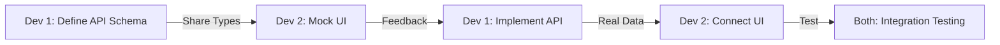

# 👥 2-Person Team Collaboration Guide
**Efficient Development Strategy for Backend + Frontend/Design Developer**

## 🎯 Role Division Strategy

### **Developer 1: Backend/Infrastructure Focus (60% Backend, 40% Integration)**
```yaml
Core Responsibilities:
  Week 1-2:
    - Database schema and models
    - API architecture (tRPC)
    - Authentication system
    - Payment gateway setup

  Week 3-4:
    - Payment processing flow
    - Email service integration
    - Admin API endpoints
    - Data validation & security

  Week 5-6:
    - Performance optimization
    - Deployment setup
    - Monitoring & logging
    - Production configuration

Support Tasks:
  - API documentation
  - Integration testing
  - Frontend API integration support
  - Code reviews for frontend
```

### **Developer 2: Frontend/Design Focus (70% Frontend, 30% Design)**
```yaml
Core Responsibilities:
  Week 1-2:
    - Quick UI mockups (low-fidelity)
    - Component library setup
    - Base layout & navigation
    - Form components

  Week 3-4:
    - Registration flow UI
    - Payment interface
    - Admin dashboard
    - Responsive design

  Week 5-6:
    - UI polish & animations
    - Multi-language testing
    - Accessibility
    - User documentation

Design Approach:
  - Use existing UI libraries (Shadcn/ui)
  - Quick sketches instead of detailed mockups
  - Iterate directly in code
  - Use component playground (Storybook)
```

## 🔄 Efficient Workflow Patterns

### **Pattern 1: API-First Development**


### **Pattern 2: Component-Driven Development**
```typescript
// Dev 2 creates component with mock data
export const EventCard = ({ event = mockEvent }) => {
  return <div>...</div>
}

// Dev 1 provides real data structure
export const eventSchema = z.object({
  id: z.string(),
  title: z.object({
    ko: z.string(),
    en: z.string()
  })
  // ...
})

// Dev 2 updates to use real data
export const EventCard = ({ event }: { event: EventType }) => {
  // Implementation with real types
}
```

### **Pattern 3: Parallel Development Tracks**
```yaml
Week Example:
  Monday:
    Dev 1: Create user authentication API
    Dev 2: Build login/signup UI with mock

  Tuesday:
    Dev 1: Implement JWT and sessions
    Dev 2: Create form validation and error states

  Wednesday:
    Both: Integration session (1-2 hours)
    - Connect UI to real API
    - Fix type mismatches
    - Test together

  Thursday:
    Dev 1: Create event management API
    Dev 2: Start event listing UI

  Friday:
    Dev 1: Code review & optimization
    Dev 2: Responsive design & polish
```

## 🎨 Rapid Design Process

### **Design Tools for Frontend Developer**

#### 1. **Quick Mockup Tools**
```yaml
Excalidraw:
  - Quick hand-drawn style mockups
  - Share via link
  - Collaborative editing

Figma (Free):
  - Use community templates
  - Copy existing designs
  - Quick modifications only

Paper & Pen:
  - Fastest for initial ideas
  - Photo → Slack → Code
```

#### 2. **Design System Shortcuts**
```typescript
// Use Tailwind UI components
import { Dialog } from '@headlessui/react'

// Use Shadcn/ui for consistency
import { Button } from '@/components/ui/button'

// Create simple design tokens
export const colors = {
  primary: 'blue-600',
  secondary: 'gray-600',
  success: 'green-600',
  error: 'red-600'
}
```

#### 3. **Component Playground Strategy**
```typescript
// Dev 2: Create variations in Storybook
export default {
  title: 'RegistrationForm',
  component: RegistrationForm
}

export const Default = () => <RegistrationForm />
export const WithError = () => <RegistrationForm error="Payment failed" />
export const Loading = () => <RegistrationForm isLoading />
export const Success = () => <RegistrationForm status="complete" />
```

## 📐 Code Organization for 2-Person Team

### **Monorepo Structure**
```
ubf-event/
├── app/                    # Next.js app directory
│   ├── api/               # Dev 1 primary
│   │   └── trpc/
│   └── [locale]/          # Dev 2 primary
│       ├── events/
│       └── admin/
├── components/            # Dev 2 primary
│   ├── ui/               # Shared
│   └── features/
├── lib/                   # Shared ownership
│   ├── api/              # Dev 1 primary
│   ├── db/               # Dev 1 primary
│   └── utils/            # Shared
├── prisma/                # Dev 1 primary
└── styles/                # Dev 2 primary
```

### **File Naming Convention**
```yaml
# Clear ownership indication
user.api.ts          # Dev 1 owns
user.component.tsx   # Dev 2 owns
user.types.ts        # Shared, Dev 1 defines
user.test.ts         # Owner tests their code
```

## 🤝 Communication Protocols

### **Daily Sync Points**
```yaml
Morning Standup (9:00 AM):
  - 10 minutes max
  - What I'm working on today
  - What I need from you
  - Any blockers

Lunch Check-in (Optional):
  - Quick Slack message
  - Progress update
  - Afternoon plan

End-of-Day Commit:
  - Push all work
  - Leave notes for tomorrow
  - Flag any overnight thoughts
```

### **API Contract Agreement**
```typescript
// Dev 1 creates contract first
// lib/api/contracts/registration.contract.ts
export const registrationContract = {
  input: z.object({
    eventId: z.string(),
    participants: z.array(participantSchema),
    programIds: z.array(z.string())
  }),
  output: z.object({
    registrationId: z.string(),
    paymentUrl: z.string(),
    totalAmount: z.number()
  })
}

// Dev 2 uses contract for UI
// components/registration/RegistrationForm.tsx
import { registrationContract } from '@/lib/api/contracts'
type FormData = z.infer<typeof registrationContract.input>
```

## 🚀 Speed Optimization Techniques

### **1. Use Existing Solutions**
```yaml
Don't Build:
  - Authentication → NextAuth
  - Payment UI → TossPayments SDK
  - Date pickers → react-datepicker
  - Tables → @tanstack/react-table
  - Forms → react-hook-form
  - Icons → lucide-react

Focus On:
  - Business logic
  - Custom workflows
  - Integration code
  - User experience
```

### **2. Progressive Enhancement**
```typescript
// Week 1: Basic functionality
const EventCard = ({ event }) => (
  <div className="border p-4">
    <h3>{event.title}</h3>
    <p>{event.date}</p>
    <button>Register</button>
  </div>
)

// Week 3: Enhanced version
const EventCard = ({ event }) => (
  <motion.div
    whileHover={{ scale: 1.02 }}
    className="border rounded-lg shadow-lg p-4 transition-all"
  >
    <Badge>{event.category}</Badge>
    <h3 className="font-bold text-xl">{event.title}</h3>
    <p className="text-gray-600">{formatDate(event.date)}</p>
    <div className="flex justify-between items-center mt-4">
      <Price amount={event.price} />
      <Button variant="primary">Register</Button>
    </div>
  </motion.div>
)
```

### **3. Shared Utilities Library**
```typescript
// lib/utils/shared.ts - Both developers contribute
export const formatCurrency = (amount: number, currency = 'KRW') => {
  // Dev 1 implements
}

export const validateEmail = (email: string) => {
  // Dev 2 implements
}

export const calculateDiscount = (price: number, discountType: string) => {
  // Dev 1 implements
}

export const truncateText = (text: string, length: number) => {
  // Dev 2 implements
}
```

## 📊 Task Prioritization Matrix

### **MoSCoW Method for 2-Person Team**
```yaml
Must Have (Week 1-3):
  - User registration flow
  - Payment processing
  - Event display
  - Basic admin panel
  - Korean language support

Should Have (Week 4-5):
  - Email notifications
  - Discount system
  - Data export
  - English support

Could Have (Week 6):
  - Analytics dashboard
  - Bulk operations
  - Spanish support
  - Advanced search

Won't Have (Post-MVP):
  - Mobile app
  - Social login
  - AI recommendations
  - Live chat support
```

## 🔧 Pair Programming Sessions

### **When to Pair**
```yaml
Always Pair:
  - Payment integration (high risk)
  - Authentication setup
  - Database schema design
  - Production deployment

Sometimes Pair:
  - Complex business logic
  - Performance optimization
  - Bug fixing (when stuck)
  - Code architecture decisions

Never Pair:
  - Simple CRUD operations
  - Basic UI components
  - Documentation writing
  - Repetitive tasks
```

### **Effective Pairing Techniques**
```yaml
Driver-Navigator:
  - 30-minute rotations
  - Navigator thinks strategically
  - Driver focuses on syntax

Ping-Pong:
  - Dev 1 writes test
  - Dev 2 implements
  - Switch roles

Mob Programming (for critical features):
  - Both on same screen
  - Discuss approach together
  - One types, both think
```

## 📈 Progress Tracking

### **Simple Kanban Board**
```yaml
Columns:
  - Backlog (prioritized list)
  - In Progress (max 2 per person)
  - Review (needs other dev's review)
  - Testing (integration testing)
  - Done (deployed to staging)

Daily Rules:
  - Update board at standup
  - Move cards immediately
  - Flag blockers with red label
  - Celebrate completions
```

### **Weekly Velocity Check**
```yaml
Friday Review:
  - What got done vs. planned
  - Why gaps occurred
  - Next week adjustments
  - Process improvements
  - Quick retrospective (15 min)
```

## 🎯 Success Tips for 2-Person Team

1. **Over-communicate**: Better to share too much than too little
2. **Document decisions**: Quick notes save future discussions
3. **Commit often**: Multiple small commits daily
4. **Test together**: Both should test each other's work
5. **Stay flexible**: Adjust roles based on workload
6. **Take breaks**: Prevent burnout with regular breaks
7. **Celebrate wins**: Acknowledge progress regularly

## 🚨 Common Pitfalls to Avoid

```yaml
Don't:
  - Work in isolation for days
  - Make assumptions about APIs
  - Skip daily standups
  - Perfectionist on MVP
  - Forget to push code
  - Break the build on Friday

Do:
  - Check in frequently
  - Clarify requirements early
  - Keep communication open
  - Focus on working features
  - Use feature branches
  - Test before weekends
```

This collaboration guide ensures both developers can work efficiently despite the small team size, with clear ownership, communication protocols, and strategies for rapid development.