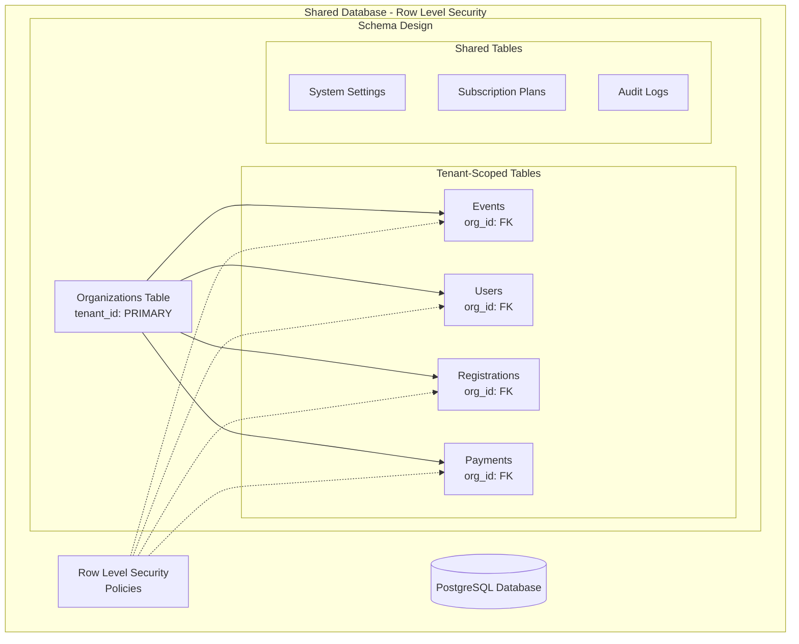
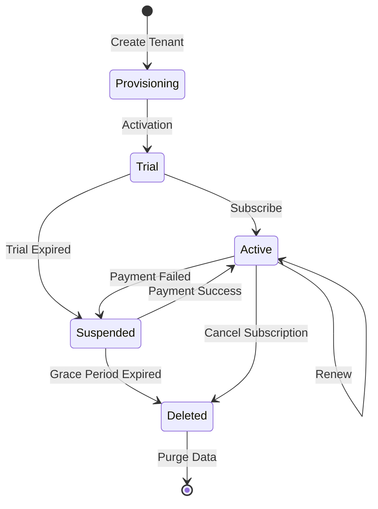

# 🏢 Multi-Tenant Architecture Design

## 🎯 Tenant Isolation Strategy

### 1. Data Isolation Model



### 2. Tenant Resolution Flow

```typescript
// middleware/tenant.ts
import { NextRequest, NextResponse } from 'next/server';
import { prisma } from '@/lib/prisma';

export interface TenantContext {
  id: string;
  slug: string;
  domain: string;
  settings: TenantSettings;
  tier: 'free' | 'starter' | 'pro' | 'enterprise';
}

export async function tenantMiddleware(req: NextRequest) {
  // 1. Extract tenant from subdomain
  const hostname = req.headers.get('host') || '';
  const subdomain = hostname.split('.')[0];

  // 2. Check custom domain mapping
  let tenant = await getTenantByDomain(hostname);

  // 3. Fallback to subdomain
  if (!tenant && subdomain) {
    tenant = await getTenantBySlug(subdomain);
  }

  // 4. Set tenant context
  if (tenant) {
    // Add tenant to headers for downstream services
    const headers = new Headers(req.headers);
    headers.set('x-tenant-id', tenant.id);
    headers.set('x-tenant-tier', tenant.tier);

    // Set Prisma client context
    await prisma.$executeRaw`SET app.current_org_id = ${tenant.id}`;

    return NextResponse.next({
      headers,
    });
  }

  // No tenant found
  return NextResponse.redirect(new URL('/tenant-not-found', req.url));
}
```

### 3. Database Row Level Security

```sql
-- Enable RLS on all tenant tables
ALTER TABLE events ENABLE ROW LEVEL SECURITY;
ALTER TABLE users ENABLE ROW LEVEL SECURITY;
ALTER TABLE registrations ENABLE ROW LEVEL SECURITY;
ALTER TABLE payments ENABLE ROW LEVEL SECURITY;

-- Create security policies
CREATE POLICY tenant_isolation_policy ON events
    FOR ALL
    TO application_role
    USING (org_id = current_setting('app.current_org_id')::UUID)
    WITH CHECK (org_id = current_setting('app.current_org_id')::UUID);

-- Function to set tenant context
CREATE OR REPLACE FUNCTION set_tenant_context(tenant_id UUID)
RETURNS void AS $$
BEGIN
    PERFORM set_config('app.current_org_id', tenant_id::text, false);
END;
$$ LANGUAGE plpgsql SECURITY DEFINER;

-- Audit function for all tenant operations
CREATE OR REPLACE FUNCTION audit_tenant_operation()
RETURNS TRIGGER AS $$
BEGIN
    INSERT INTO audit_logs (
        tenant_id,
        table_name,
        operation,
        user_id,
        old_data,
        new_data,
        ip_address,
        timestamp
    ) VALUES (
        current_setting('app.current_org_id')::UUID,
        TG_TABLE_NAME,
        TG_OP,
        current_setting('app.current_user_id', true)::UUID,
        to_jsonb(OLD),
        to_jsonb(NEW),
        current_setting('app.client_ip', true),
        NOW()
    );
    RETURN NEW;
END;
$$ LANGUAGE plpgsql;
```

## 🔐 Tenant Security Implementation

### 1. Authentication with Tenant Context

```typescript
// lib/auth/tenant-auth.ts
import NextAuth, { NextAuthOptions } from 'next-auth';
import CredentialsProvider from 'next-auth/providers/credentials';
import { verifyPassword } from '@/lib/auth/password';
import { prisma } from '@/lib/prisma';

export const authOptions: NextAuthOptions = {
  providers: [
    CredentialsProvider({
      name: 'credentials',
      credentials: {
        email: { label: "Email", type: "email" },
        password: { label: "Password", type: "password" },
        tenantId: { label: "Tenant", type: "hidden" }
      },
      async authorize(credentials) {
        if (!credentials?.email || !credentials?.password || !credentials?.tenantId) {
          throw new Error('Invalid credentials');
        }

        // Set tenant context for query
        await prisma.$executeRaw`SELECT set_tenant_context(${credentials.tenantId}::UUID)`;

        const user = await prisma.user.findFirst({
          where: {
            email: credentials.email,
            org_id: credentials.tenantId
          },
          include: {
            organization: true,
            roles: true
          }
        });

        if (!user || !await verifyPassword(credentials.password, user.password)) {
          throw new Error('Invalid credentials');
        }

        return {
          id: user.id,
          email: user.email,
          name: user.name,
          tenantId: user.org_id,
          tenantSlug: user.organization.slug,
          roles: user.roles.map(r => r.name),
          tier: user.organization.subscription_tier
        };
      }
    })
  ],
  callbacks: {
    async jwt({ token, user }) {
      if (user) {
        token.tenantId = user.tenantId;
        token.tenantSlug = user.tenantSlug;
        token.roles = user.roles;
        token.tier = user.tier;
      }
      return token;
    },
    async session({ session, token }) {
      session.user.tenantId = token.tenantId;
      session.user.tenantSlug = token.tenantSlug;
      session.user.roles = token.roles;
      session.user.tier = token.tier;
      return session;
    }
  }
};
```

### 2. API Route Protection

```typescript
// lib/api/with-tenant.ts
import { NextApiRequest, NextApiResponse } from 'next';
import { getServerSession } from 'next-auth/next';
import { authOptions } from '@/lib/auth/tenant-auth';
import { prisma } from '@/lib/prisma';

export interface TenantApiRequest extends NextApiRequest {
  tenant: {
    id: string;
    slug: string;
    tier: string;
  };
  user: {
    id: string;
    roles: string[];
  };
}

export function withTenant(
  handler: (req: TenantApiRequest, res: NextApiResponse) => Promise<void>,
  options?: {
    roles?: string[];
    tiers?: string[];
  }
) {
  return async (req: NextApiRequest, res: NextApiResponse) => {
    try {
      // Get session
      const session = await getServerSession(req, res, authOptions);

      if (!session?.user?.tenantId) {
        return res.status(401).json({ error: 'Unauthorized' });
      }

      // Check tier restrictions
      if (options?.tiers && !options.tiers.includes(session.user.tier)) {
        return res.status(403).json({
          error: 'Feature not available in your subscription tier'
        });
      }

      // Check role restrictions
      if (options?.roles) {
        const hasRole = options.roles.some(role =>
          session.user.roles.includes(role)
        );
        if (!hasRole) {
          return res.status(403).json({ error: 'Insufficient permissions' });
        }
      }

      // Set tenant context for database queries
      await prisma.$executeRaw`SELECT set_tenant_context(${session.user.tenantId}::UUID)`;
      await prisma.$executeRaw`SET app.current_user_id = ${session.user.id}`;
      await prisma.$executeRaw`SET app.client_ip = ${req.headers['x-forwarded-for'] || req.socket.remoteAddress}`;

      // Add tenant to request
      (req as TenantApiRequest).tenant = {
        id: session.user.tenantId,
        slug: session.user.tenantSlug,
        tier: session.user.tier
      };
      (req as TenantApiRequest).user = {
        id: session.user.id,
        roles: session.user.roles
      };

      // Call handler
      return handler(req as TenantApiRequest, res);
    } catch (error) {
      console.error('Tenant middleware error:', error);
      return res.status(500).json({ error: 'Internal server error' });
    }
  };
}
```

## 🏗️ Tenant Provisioning System

### 1. New Tenant Onboarding

```typescript
// services/tenant-provisioning.ts
export class TenantProvisioningService {
  async createTenant(input: CreateTenantInput): Promise<Organization> {
    return await prisma.$transaction(async (tx) => {
      // 1. Create organization
      const org = await tx.organization.create({
        data: {
          slug: input.slug,
          name: input.name,
          domain: input.customDomain,
          subscription_tier: input.tier || 'free',
          settings: {
            locale: input.locale || 'ko',
            timezone: input.timezone || 'Asia/Seoul',
            currency: input.currency || 'KRW',
            features: this.getFeaturesForTier(input.tier || 'free')
          }
        }
      });

      // 2. Create admin user
      const adminUser = await tx.user.create({
        data: {
          org_id: org.id,
          email: input.adminEmail,
          name: input.adminName,
          password: await hashPassword(input.adminPassword),
          roles: {
            create: {
              name: 'super_admin',
              permissions: ['*']
            }
          }
        }
      });

      // 3. Create default categories/templates
      await this.createDefaultContent(tx, org.id);

      // 4. Setup payment account
      await this.setupPaymentAccounts(tx, org.id, input.paymentInfo);

      // 5. Configure subdomain
      await this.configureSubdomain(org.slug);

      // 6. Send welcome email
      await this.sendWelcomeEmail(adminUser, org);

      // 7. Create audit log
      await tx.auditLog.create({
        data: {
          tenant_id: org.id,
          action: 'TENANT_CREATED',
          metadata: { tier: input.tier }
        }
      });

      return org;
    });
  }

  private getFeaturesForTier(tier: string) {
    const features = {
      free: {
        maxEvents: 1,
        maxParticipants: 100,
        customDomain: false,
        emailTemplates: false,
        analytics: false,
        apiAccess: false
      },
      starter: {
        maxEvents: 5,
        maxParticipants: 500,
        customDomain: false,
        emailTemplates: true,
        analytics: true,
        apiAccess: false
      },
      pro: {
        maxEvents: -1, // unlimited
        maxParticipants: -1,
        customDomain: true,
        emailTemplates: true,
        analytics: true,
        apiAccess: true
      },
      enterprise: {
        maxEvents: -1,
        maxParticipants: -1,
        customDomain: true,
        emailTemplates: true,
        analytics: true,
        apiAccess: true,
        sla: true,
        dedicatedSupport: true
      }
    };

    return features[tier] || features.free;
  }
}
```

## 📊 Tenant Resource Management

### 1. Resource Quota System

```typescript
// lib/tenant/quota-manager.ts
export class TenantQuotaManager {
  async checkQuota(tenantId: string, resource: string): Promise<boolean> {
    const tenant = await prisma.organization.findUnique({
      where: { id: tenantId },
      include: {
        _count: {
          select: {
            events: true,
            users: true,
            registrations: true
          }
        }
      }
    });

    const features = tenant.settings.features;

    switch (resource) {
      case 'events':
        if (features.maxEvents === -1) return true;
        return tenant._count.events < features.maxEvents;

      case 'participants':
        if (features.maxParticipants === -1) return true;
        const totalParticipants = await this.countTotalParticipants(tenantId);
        return totalParticipants < features.maxParticipants;

      case 'storage':
        const usedStorage = await this.calculateStorageUsage(tenantId);
        return usedStorage < this.getStorageLimit(tenant.subscription_tier);

      default:
        return false;
    }
  }

  async enforceRateLimit(tenantId: string, endpoint: string): Promise<boolean> {
    const key = `rate_limit:${tenantId}:${endpoint}`;
    const limit = this.getRateLimitForTier(tenant.subscription_tier);

    const current = await redis.incr(key);
    if (current === 1) {
      await redis.expire(key, 60); // 1 minute window
    }

    return current <= limit;
  }

  private getRateLimitForTier(tier: string): number {
    const limits = {
      free: 60,      // 60 requests per minute
      starter: 300,  // 300 requests per minute
      pro: 1000,     // 1000 requests per minute
      enterprise: -1 // unlimited
    };

    return limits[tier] || limits.free;
  }
}
```

### 2. Tenant Data Migration

```typescript
// services/tenant-migration.ts
export class TenantMigrationService {
  async exportTenantData(tenantId: string): Promise<Buffer> {
    // Set tenant context
    await prisma.$executeRaw`SELECT set_tenant_context(${tenantId}::UUID)`;

    const data = {
      organization: await prisma.organization.findUnique({
        where: { id: tenantId }
      }),
      events: await prisma.event.findMany(),
      programs: await prisma.program.findMany(),
      registrations: await prisma.registration.findMany(),
      users: await prisma.user.findMany({
        select: {
          id: true,
          email: true,
          name: true,
          roles: true
          // Exclude passwords
        }
      }),
      payments: await prisma.payment.findMany({
        select: {
          id: true,
          amount: true,
          status: true,
          created_at: true
          // Exclude sensitive payment data
        }
      })
    };

    return Buffer.from(JSON.stringify(data, null, 2));
  }

  async importTenantData(tenantId: string, data: Buffer): Promise<void> {
    const parsed = JSON.parse(data.toString());

    await prisma.$transaction(async (tx) => {
      // Validate and import data
      // Implementation details...
    });
  }

  async deleteTenant(tenantId: string): Promise<void> {
    // Soft delete with data retention for compliance
    await prisma.organization.update({
      where: { id: tenantId },
      data: {
        deleted_at: new Date(),
        status: 'deleted',
        // Anonymize PII after retention period
        scheduled_purge_date: new Date(Date.now() + 30 * 24 * 60 * 60 * 1000)
      }
    });

    // Revoke all active sessions
    await this.revokeAllSessions(tenantId);

    // Cancel subscriptions
    await this.cancelSubscriptions(tenantId);
  }
}
```

## 🌐 Tenant Domain Management

```typescript
// services/domain-management.ts
export class DomainManagementService {
  async addCustomDomain(tenantId: string, domain: string): Promise<void> {
    // 1. Validate domain ownership
    const verificationCode = await this.generateVerificationCode(tenantId);

    // 2. Check DNS records
    const verified = await this.verifyDNSRecords(domain, verificationCode);

    if (!verified) {
      throw new Error('Domain verification failed');
    }

    // 3. Update tenant
    await prisma.organization.update({
      where: { id: tenantId },
      data: {
        domain,
        domain_verified: true,
        domain_verified_at: new Date()
      }
    });

    // 4. Configure SSL
    await this.provisionSSLCertificate(domain);

    // 5. Update routing
    await this.updateDomainRouting(domain, tenantId);
  }

  private async verifyDNSRecords(domain: string, code: string): Promise<boolean> {
    // Check TXT record for verification
    // Check CNAME for routing
    // Implementation...
    return true;
  }
}
```

## 🔄 Tenant Lifecycle Management



This multi-tenant architecture provides:
- **Complete data isolation** with Row Level Security
- **Flexible tenant provisioning** and management
- **Resource quota enforcement** based on subscription tiers
- **Custom domain support** for enterprise tenants
- **Comprehensive audit logging** for compliance
- **Scalable architecture** supporting thousands of tenants