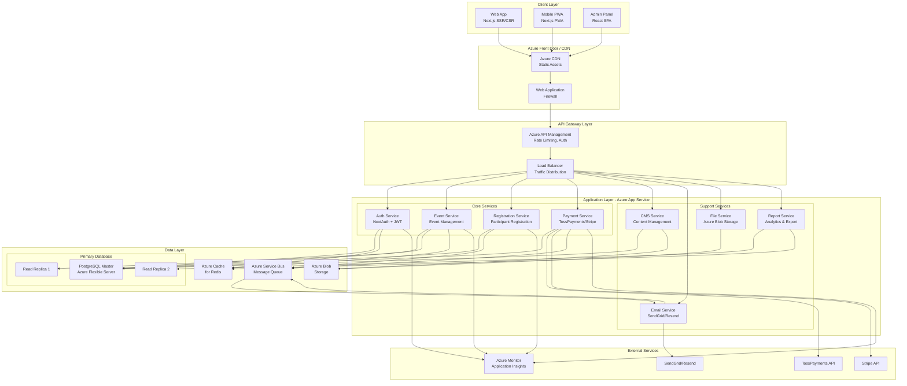
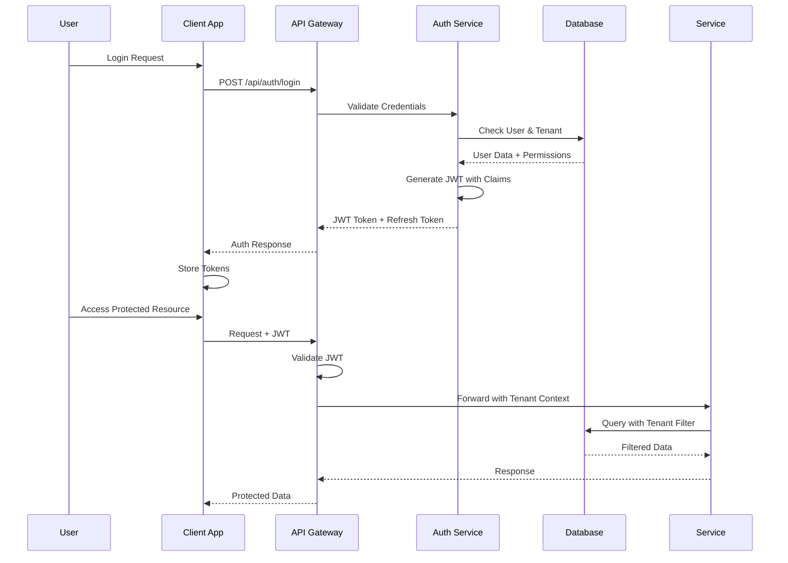
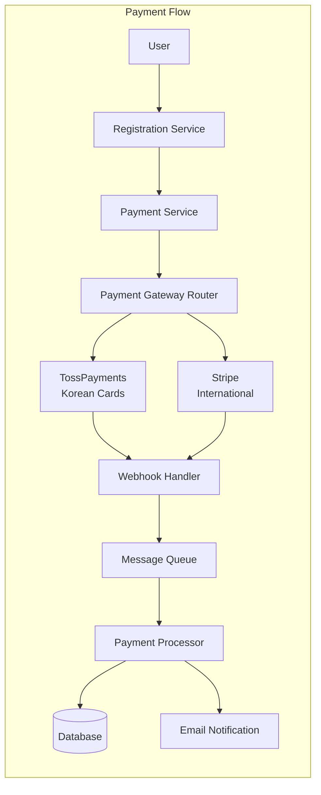

# 🏗️ Multi-Tenant Church Event Platform - System Architecture

## 📊 Architecture Overview



## 🔐 Security Architecture

### 1. Multi-Tenant Isolation Strategy

```yaml
Tenant Isolation Levels:
  Database Level:
    - Row Level Security (RLS) in PostgreSQL
    - Tenant ID in every table
    - Automatic filtering via Prisma middleware

  Application Level:
    - JWT with tenant claims
    - Request context isolation
    - API rate limiting per tenant

  Storage Level:
    - Separate blob containers per tenant
    - SAS token-based access control

  Network Level:
    - Subdomain isolation (tenant.platform.com)
    - WAF rules per tenant
    - IP whitelisting for admin access
```

### 2. Authentication & Authorization Flow



### 3. Security Layers

```yaml
Layer 1 - Network Security:
  - Azure Front Door with WAF
  - DDoS Protection Standard
  - Private endpoints for databases
  - Network Security Groups (NSG)

Layer 2 - Application Security:
  - OWASP Top 10 compliance
  - Input validation (Zod)
  - SQL injection prevention (Prisma)
  - XSS protection (React)
  - CSRF tokens
  - Rate limiting

Layer 3 - Data Security:
  - Encryption at rest (TDE)
  - Encryption in transit (TLS 1.3)
  - Column-level encryption for PII
  - Secure payment tokenization
  - GDPR compliance

Layer 4 - Access Control:
  - Role-Based Access Control (RBAC)
  - Principle of least privilege
  - MFA for admin accounts
  - Session management
  - Audit logging
```

## 🚀 Scalability Architecture

### 1. Horizontal Scaling Strategy

```yaml
Application Tier:
  Azure App Service:
    - Auto-scaling rules (CPU > 70%, Memory > 80%)
    - Min instances: 2 (HA)
    - Max instances: 10
    - Scale-out time: 1 minute

  Load Balancing:
    - Round-robin distribution
    - Health checks every 30s
    - Session affinity for WebSocket

Database Tier:
  PostgreSQL Flexible Server:
    - Primary: 4 vCores, 16GB RAM (scale up to 32 vCores)
    - Read Replicas: 2 instances for read distribution
    - Connection pooling via PgBouncer
    - Partition large tables by tenant_id

  Sharding Strategy (Future):
    - Shard by tenant_id
    - Shard mapping in Redis
    - Cross-shard queries via application

Caching Strategy:
  Redis Cache:
    - L1: Application memory cache (5 min)
    - L2: Redis distributed cache (1 hour)
    - L3: Database query cache

  Cache Keys:
    - tenant:{id}:events
    - tenant:{id}:registration:{id}
    - session:{id}
    - payment:status:{id}
```

### 2. Performance Optimization

```yaml
Frontend Optimization:
  - Code splitting by route
  - Lazy loading components
  - Image optimization (WebP, AVIF)
  - CDN for static assets
  - Service Worker caching

API Optimization:
  - GraphQL/tRPC for efficient data fetching
  - DataLoader pattern for N+1 queries
  - Response compression (Brotli)
  - Connection keep-alive

Database Optimization:
  - Indexed foreign keys
  - Composite indexes for common queries
  - Materialized views for reports
  - Query result caching
  - Batch operations
```

## 💳 Payment Processing Architecture



### Payment Security

```yaml
Security Measures:
  - PCI DSS compliance (no card storage)
  - Payment tokenization
  - Idempotency keys
  - Webhook signature verification
  - SSL certificate pinning
  - Transaction logging
  - Fraud detection rules

Refund Handling:
  - Async refund processing
  - Partial refund support
  - Audit trail
  - Automatic reconciliation
```

## 🗄️ Database Architecture

```sql
-- Core Multi-Tenant Schema
CREATE SCHEMA core;

-- Enable RLS
ALTER TABLE core.organizations ENABLE ROW LEVEL SECURITY;
ALTER TABLE core.events ENABLE ROW LEVEL SECURITY;

-- Organizations (Tenants)
CREATE TABLE core.organizations (
    id UUID PRIMARY KEY DEFAULT gen_random_uuid(),
    slug VARCHAR(50) UNIQUE NOT NULL,
    name VARCHAR(200) NOT NULL,
    domain VARCHAR(100),
    settings JSONB DEFAULT '{}',
    subscription_tier VARCHAR(20) DEFAULT 'free',
    created_at TIMESTAMPTZ DEFAULT NOW(),
    updated_at TIMESTAMPTZ DEFAULT NOW()
);

-- Events
CREATE TABLE core.events (
    id UUID PRIMARY KEY DEFAULT gen_random_uuid(),
    org_id UUID REFERENCES core.organizations(id),
    slug VARCHAR(100) NOT NULL,
    name JSONB NOT NULL, -- {"ko": "이름", "en": "Name", "es": "Nombre"}
    description JSONB,
    start_date DATE NOT NULL,
    end_date DATE NOT NULL,
    registration_start TIMESTAMPTZ,
    registration_end TIMESTAMPTZ,
    max_participants INTEGER,
    settings JSONB DEFAULT '{}',
    status VARCHAR(20) DEFAULT 'draft',
    created_at TIMESTAMPTZ DEFAULT NOW(),
    UNIQUE(org_id, slug)
);

-- Programs
CREATE TABLE core.programs (
    id UUID PRIMARY KEY DEFAULT gen_random_uuid(),
    event_id UUID REFERENCES core.events(id),
    code VARCHAR(50) NOT NULL,
    name JSONB NOT NULL,
    description JSONB,
    price DECIMAL(10,2) NOT NULL,
    early_bird_price DECIMAL(10,2),
    early_bird_deadline DATE,
    max_capacity INTEGER,
    current_participants INTEGER DEFAULT 0,
    settings JSONB DEFAULT '{}',
    UNIQUE(event_id, code)
);

-- Indexes for Performance
CREATE INDEX idx_events_org_id ON core.events(org_id);
CREATE INDEX idx_events_dates ON core.events(start_date, end_date);
CREATE INDEX idx_programs_event_id ON core.programs(event_id);

-- RLS Policies
CREATE POLICY tenant_isolation ON core.events
    FOR ALL
    USING (org_id = current_setting('app.current_org_id')::UUID);
```

## 🔄 CI/CD & Deployment Architecture

```yaml
CI/CD Pipeline:
  Source Control:
    - GitHub with branch protection
    - Feature branches → develop → main

  Build Pipeline (GitHub Actions):
    1. Code checkout
    2. Dependencies installation
    3. Type checking (TypeScript)
    4. Linting (ESLint)
    5. Unit tests (Jest)
    6. Build application
    7. Security scanning (Snyk)
    8. Docker image build
    9. Push to Azure Container Registry

  Deployment Pipeline:
    Development:
      - Auto-deploy on develop merge
      - Azure App Service Staging Slot

    Staging:
      - Manual approval required
      - Blue-Green deployment
      - Smoke tests

    Production:
      - Manual approval + 2FA
      - Rolling deployment
      - Health checks
      - Auto-rollback on failure

Infrastructure as Code:
  - Terraform for Azure resources
  - Separate state files per environment
  - Version controlled
  - Automated validation
```

## 📊 Monitoring & Observability

```yaml
Monitoring Stack:
  Application Monitoring:
    - Azure Application Insights
    - Custom metrics and events
    - User flow tracking
    - Performance monitoring

  Infrastructure Monitoring:
    - Azure Monitor
    - Resource metrics
    - Alert rules
    - Auto-scaling triggers

  Business Monitoring:
    - Registration metrics
    - Payment success rate
    - User engagement
    - Revenue tracking

  Logging:
    - Structured logging (Winston)
    - Log aggregation (Azure Log Analytics)
    - Error tracking (Sentry)
    - Audit logs for compliance

Alerting Rules:
  Critical:
    - Payment failure rate > 10%
    - Database connection errors
    - API response time > 3s

  Warning:
    - CPU usage > 80%
    - Memory usage > 85%
    - Queue depth > 1000

  Info:
    - New tenant registration
    - Large event created
    - Deployment completed
```

## 🎯 MVP Architecture (November Target)

```yaml
Simplified MVP Stack:
  Frontend:
    - Single Next.js app (no separate admin)
    - Basic responsive design
    - Korean language only initially

  Backend:
    - Monolithic Next.js API routes
    - Single PostgreSQL database
    - Basic caching with Redis

  Infrastructure:
    - Single Azure App Service
    - Azure Database for PostgreSQL (Basic tier)
    - Azure Blob Storage

  Payment:
    - TossPayments only
    - Basic webhook handling

  Deployment:
    - Manual deployment initially
    - Single environment

  Post-MVP Evolution:
    - Extract services gradually
    - Add read replicas
    - Implement full CI/CD
    - Add monitoring
```

## 🔑 Key Architecture Decisions

1. **Next.js Monolith First**: Start simple, extract services as needed
2. **PostgreSQL with RLS**: Built-in multi-tenancy without complexity
3. **Azure PaaS**: Managed services reduce operational overhead
4. **JWT + Redis Sessions**: Stateless auth with session management
5. **Event-Driven Processing**: Queue-based for async operations
6. **CDN-First**: Optimize for global content delivery
7. **Progressive Enhancement**: Start simple, scale when needed

## 📈 Capacity Planning

```yaml
Expected Load (Per Event):
  - Concurrent users: 500-1000
  - Peak registration: 100/minute
  - Database connections: 100 pooled
  - Storage: 10GB per tenant
  - Bandwidth: 1TB/month

Resource Allocation:
  MVP:
    - App Service: B2 (2 vCores, 3.5GB RAM)
    - Database: 2 vCores, 10GB storage
    - Redis: C1 (1GB cache)

  Production:
    - App Service: P2V3 (4 vCores, 16GB RAM) x3
    - Database: 8 vCores, 100GB storage
    - Redis: P1 (6GB cache)
    - CDN: Standard tier
```