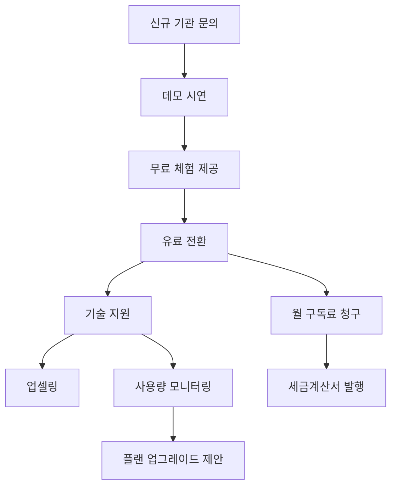
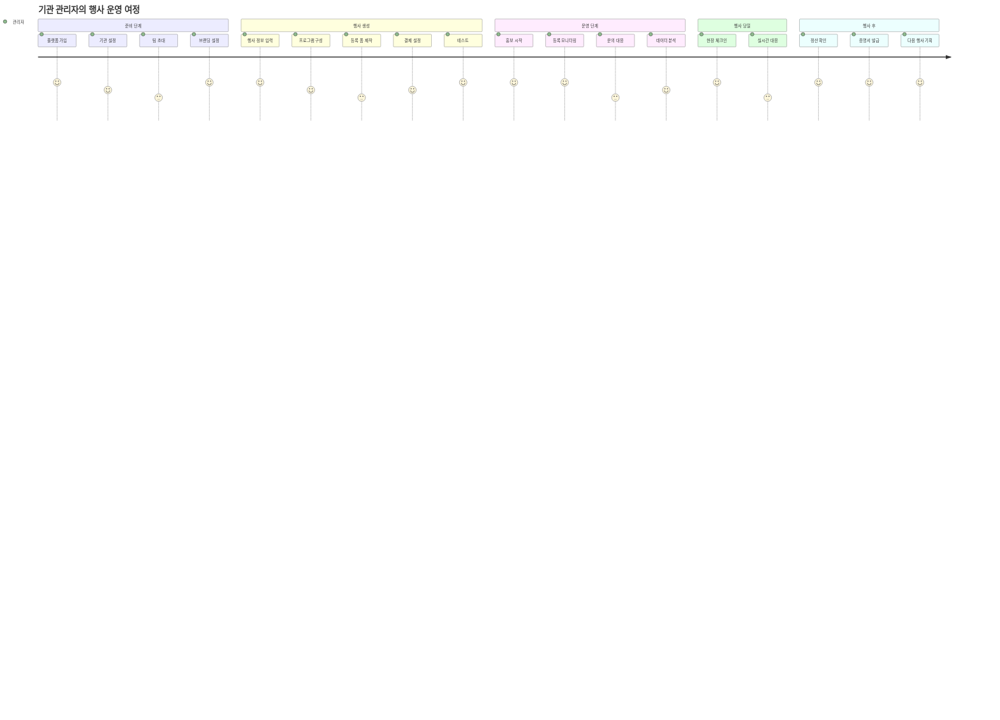
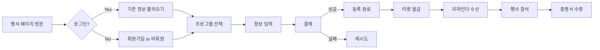

# 🌐 Multi-Tenant Event Platform - 프로젝트 개요 및 사용 시나리오

## 📌 프로젝트 소개

### 프로젝트명: EventHub Platform (이벤트허브 플랫폼)

**한 줄 설명**: 교회, 단체, 기업이 자체 브랜드로 행사 등록 시스템을 운영할 수 있는 B2B SaaS 플랫폼

### 🎯 핵심 가치 제안

```
"우리는 행사 등록 시스템을 '판매'합니다"

기관들이 자체 개발 없이도:
✅ 전문적인 행사 등록 페이지 운영
✅ 안전한 온라인 결제 처리
✅ 참가자 데이터 관리
✅ 자체 브랜드로 서비스 제공
```

### 🏢 타겟 고객

1. **Primary Target**: 중대형 교회/종교단체
   - 정기적인 수련회, 세미나, 대회 개최
   - 수백~수천명 규모 행사 운영
   - IT 전담 인력 부재

2. **Secondary Target**: 교육기관/협회
   - 정기 컨퍼런스, 워크샵 개최
   - 회원 대상 교육 프로그램 운영
   - 체계적인 등록 관리 필요

3. **Tertiary Target**: 중소기업
   - 사내 교육, 세미나 운영
   - 고객 대상 이벤트 개최
   - 비용 효율적인 솔루션 필요

---

## 🔄 비즈니스 모델

### 수익 구조 (Dual Revenue Stream)


### 💰 요금제 구조

| 플랜 | 월 요금 | 행사 수 | 참가자 수 | 주요 기능 |
|------|---------|---------|-----------|-----------|
| **Free** | ₩0 | 1개 | 50명/월 | 기본 기능 |
| **Basic** | ₩99,000 | 3개 | 200명/월 | + 이메일 자동화 |
| **Pro** | ₩299,000 | 10개 | 1,000명/월 | + 커스텀 도메인, API |
| **Enterprise** | 맞춤 견적 | 무제한 | 무제한 | + 전담 지원, 커스터마이징 |

### 추가 수익원
- 거래 수수료: 결제 금액의 1-2% (Pro 이상 면제)
- SMS 발송: 건당 과금
- 추가 저장 공간: GB당 월 ₩5,000
- 프리미엄 지원: 월 ₩50,000

---

## 👥 사용자 페르소나 및 시나리오

### 🏛️ Persona 1: 대형 교회 - 서울 UBF

**배경**:
- 회원 수: 5,000명
- 연간 행사: 10-15개 (수련회, 세미나, 특별집회)
- 행사 규모: 100-2,000명
- 현재 문제: 구글폼 + 수동 엑셀 관리 + 계좌이체 확인

**시나리오**:

#### 1단계: 플랫폼 가입 및 설정
```
1. 김목사님이 EventHub Platform 웹사이트 방문
2. "30일 무료 체험 시작" 클릭
3. 기관 정보 입력:
   - 기관명: 서울 UBF
   - 도메인 선택: seoul-ubf.eventhub.kr
   - 관리자 계정 생성
4. Pro 플랜 선택 (월 299,000원)
5. 브랜딩 설정:
   - 로고 업로드
   - 색상 테마 설정
   - 커스텀 도메인 연결: events.seoul-ubf.org
```

#### 2단계: 첫 행사 생성 - "2026 세계선교대회"
```
1. "새 행사 만들기" 클릭
2. 행사 정보 입력:
   - 제목: 2026 세계선교대회
   - 일정: 2026.07.15-18
   - 장소: 일산 KINTEX
   - 참가비: 일반 150,000원 / 얼리버드 120,000원
3. 프로그램 설정:
   - 본 대회 (필수)
   - 선교사 수양회 (선택)
   - 청년 리더 트레이닝 (선택)
4. 등록 폼 커스터마이징:
   - 소속 교회 (필수)
   - 식사 옵션 (채식/일반/할랄)
   - 숙박 필요 여부
   - 공항 픽업 서비스
5. 결제 설정:
   - TossPayments 연동
   - 계좌이체/카드결제 활성화
6. 이메일 템플릿 설정:
   - 등록 확인 메일
   - 결제 완료 메일
   - 행사 1주일 전 리마인더
```

#### 3단계: 참가자 등록 프로세스
```
참가자 (이성민)의 경험:

1. events.seoul-ubf.org/wmc-2026 접속
2. "지금 등록하기" 클릭
3. 프로그램 선택:
   - ✅ 본 대회
   - ✅ 청년 리더 트레이닝
4. 개인정보 입력
5. 추가 정보 입력 (식사: 일반, 숙박: 필요)
6. 결제: 카드결제 150,000원
7. 등록 완료:
   - QR코드 티켓 발급
   - 확인 이메일 수신
   - 캘린더 일정 추가
```

#### 4단계: 관리자 행사 운영
```
1. 실시간 대시보드 확인:
   - 현재 등록: 847명
   - 수입: 127,050,000원
   - 프로그램별 현황 확인
2. 참가자 관리:
   - 엑셀 다운로드
   - 일괄 이메일 발송
   - 환불 처리 (코로나 확진자)
3. 현장 체크인:
   - QR 스캐너 앱으로 입장 확인
   - 실시간 참석 통계
4. 행사 후:
   - 참가 증명서 자동 발급
   - 피드백 설문 발송
   - 최종 보고서 생성
```

---

### 👨‍💼 Persona 2: 중소기업 - 테크스타트업 A사

**배경**:
- 직원 수: 50명
- 연간 행사: 5-6개 (세미나, 워크샵, 고객 이벤트)
- 행사 규모: 20-100명
- 현재 문제: 이벤터스 같은 서비스는 너무 비쌈

**시나리오**:

#### Basic 플랜으로 시작 (월 99,000원)
```
1. 분기별 고객 세미나 개최
   - 참가자 50명 규모
   - 무료 행사 (마케팅 목적)
   - 간단한 등록 폼만 필요

2. 연례 개발자 컨퍼런스
   - 참가자 100명 규모
   - 참가비 50,000원
   - 트랙별 세션 관리 필요

3. 장점:
   - 이벤터스 대비 70% 저렴
   - 필요한 기능만 선택 사용
   - 자체 브랜드로 운영 가능
```

---

### 🎓 Persona 3: 교육 협회

**배경**:
- 한국 IT 교육 협회
- 회원사: 200개
- 연간 행사: 20개+ (자격증 시험, 교육, 컨퍼런스)

**시나리오**:

#### Enterprise 플랜 사용
```
1. 맞춤 기능:
   - 회원사별 할인 코드
   - 자격증 시험 응시 자격 검증
   - CPE 학점 자동 발급
   - 다단계 승인 프로세스

2. API 연동:
   - 기존 회원 DB 연동
   - 자동 회원 확인
   - 학점 관리 시스템 연계

3. 멀티 행사 관리:
   - 지역별 교육 동시 진행
   - 통합 리포팅
   - 중앙 집중식 관리
```

---

## 🚀 플랫폼 사용 흐름

### A. 플랫폼 운영자 (EventHub)



### B. 기관 관리자 Journey



### C. 참가자 Experience Flow



---

## 💡 핵심 차별화 포인트

### 1. 🏷️ 가격 경쟁력
```
경쟁사 대비 가격:
- 이벤터스: 월 50만원~ → EventHub: 월 9.9만원~
- 온오프믹스: 건당 수수료 5% → EventHub: 1-2%
- 자체 개발: 초기 5천만원+ → EventHub: 월 구독
```

### 2. 🎨 완전한 화이트 라벨
```
✅ 커스텀 도메인 (event.your-domain.com)
✅ 완전한 브랜딩 (로고, 색상, 폰트)
✅ 이메일 발신자 커스터마이징
✅ EventHub 로고 제거 (Pro 이상)
```

### 3. 🇰🇷 한국 시장 최적화
```
✅ 토스페이먼츠, 포트원 등 국내 PG 완벽 지원
✅ 계좌이체, 무통장입금 지원
✅ 세금계산서 자동 발행
✅ 한국어 우선 지원 (영어, 스페인어 추가)
```

### 4. 🔧 유연한 커스터마이징
```
✅ 드래그 앤 드롭 폼 빌더
✅ 조건부 로직 지원
✅ 다단계 승인 프로세스
✅ API를 통한 외부 시스템 연동
```

---

## 📊 예상 시장 규모 및 성장 전략

### 시장 규모 (한국)
```
TAM (Total Addressable Market):
- 종교단체: 약 50,000개
- 협회/단체: 약 10,000개
- 중소기업: 약 100,000개
= 총 160,000개 잠재 고객

SAM (Serviceable Addressable Market):
- 정기 행사 개최 단체: 약 20,000개
- 평균 객단가: 월 20만원
= 연간 480억원 시장

SOM (Serviceable Obtainable Market):
- 3년 내 목표 점유율: 5%
- 목표 고객 수: 1,000개
= 연간 24억원 매출 목표
```

### 성장 전략

#### Phase 1: MVP & PMF (Month 1-6)
```
목표: 10개 파일럿 고객 확보
- 무료 베타 테스트
- 피드백 기반 빠른 개선
- 초기 레퍼런스 확보
```

#### Phase 2: Growth (Month 7-12)
```
목표: 100개 유료 고객
- 공격적인 프로모션 (첫 3개월 50% 할인)
- 파트너십 구축 (PG사, 마케팅 에이전시)
- 콘텐츠 마케팅 (성공 사례, 가이드)
```

#### Phase 3: Scale (Year 2)
```
목표: 500개 유료 고객
- 엔터프라이즈 영업 강화
- API 생태계 구축
- 국제화 (일본, 동남아)
```

#### Phase 4: Expansion (Year 3+)
```
목표: 1,000개+ 유료 고객
- 버티컬 특화 솔루션 (교육, 의료, 공공)
- M&A (경쟁사, 보완재)
- 플랫폼 생태계 (앱 마켓플레이스)
```

---

## 🏆 성공 지표 (KPIs)

### 비즈니스 메트릭
```yaml
Revenue Metrics:
  MRR: Monthly Recurring Revenue
  ARR: Annual Recurring Revenue
  ARPU: Average Revenue Per User
  LTV: Customer Lifetime Value

Growth Metrics:
  신규 고객 수: 월별 신규 가입
  Churn Rate: 월별 이탈률 < 5%
  NRR: Net Revenue Retention > 110%
  CAC Payback: < 12개월

Usage Metrics:
  MAU: Monthly Active Users
  행사 생성 수: 월별 신규 행사
  등록 완료율: > 80%
  결제 성공률: > 95%
```

### 기술 메트릭
```yaml
Performance:
  Page Load Time: < 2초
  API Response Time: < 200ms
  Uptime: > 99.9%
  Error Rate: < 0.1%

Scale:
  동시 접속자: 10,000+
  일일 처리 등록: 100,000+
  일일 처리 결제: 50,000+
```

---

## 🚨 리스크 및 대응 전략

### 1. 기술적 리스크
```
리스크: 대규모 동시 등록 시 서버 다운
대응:
- Auto-scaling 구성
- 대기열 시스템 구현
- CDN 적극 활용
- 로드 테스팅 정기 실시
```

### 2. 보안 리스크
```
리스크: 개인정보 유출, 결제 정보 해킹
대응:
- PCI DSS 준수
- 정기 보안 감사
- 결제 정보 비저장 (토큰화)
- 2FA 의무화
```

### 3. 비즈니스 리스크
```
리스크: 대형 경쟁사 진입 (네이버, 카카오)
대응:
- 버티컬 특화 (교회, 협회)
- 깊은 도메인 전문성 확보
- 빠른 기능 개발 사이클
- 강력한 고객 록인 (데이터, 커스터마이징)
```

### 4. 운영 리스크
```
리스크: 핵심 인력 이탈
대응:
- 스톡옵션 제공
- 지식 문서화
- 크로스 트레이닝
- 외주/파트너 활용
```

---

## 📞 고객 지원 체계

### 지원 레벨

| 플랜 | 지원 채널 | 응답 시간 | 전담 매니저 |
|------|-----------|-----------|-------------|
| Free | 이메일 | 48시간 | ❌ |
| Basic | 이메일, 채팅 | 24시간 | ❌ |
| Pro | + 전화 | 4시간 | ❌ |
| Enterprise | + 방문 | 1시간 | ✅ |

### 온보딩 프로그램
```
Week 1: 플랫폼 설정
- 전담 온보딩 매니저 배정
- 1:1 화상 교육 (2시간)
- 기본 설정 대행

Week 2: 첫 행사 생성
- 행사 생성 실습
- 모의 등록 테스트
- Q&A 세션

Week 3: 실전 운영
- 실제 행사 런칭 지원
- 실시간 모니터링
- 트러블슈팅

Week 4: 최적화
- 사용 패턴 분석
- 개선 제안
- 추가 기능 교육
```

---

## 🎯 결론

EventHub Platform은 단순한 행사 등록 도구가 아닌, **기관의 디지털 전환 파트너**입니다.

### 우리의 비전
> "모든 기관이 전문적인 행사 운영 시스템을 갖출 수 있는 세상"

### 우리의 미션
> "복잡한 행사 운영을 간단하게, 비싼 시스템을 저렴하게, 획일적인 서비스를 맞춤형으로"

### 왜 지금인가?
1. **디지털 전환 가속화**: 코로나 이후 온라인 등록 필수화
2. **결제 인프라 성숙**: 간편결제 일상화
3. **SaaS 수용도 증가**: 구독 모델에 대한 거부감 감소
4. **인력난 심화**: IT 전문 인력 구하기 어려움

### 우리가 만드는 가치
- **기관에게**: 시간 절약, 비용 절감, 전문성 확보
- **참가자에게**: 편리한 등록, 안전한 결제, 체계적인 관리
- **사회에게**: 행사 문화 발전, 디지털 격차 해소

---

**EventHub Platform** - 당신의 행사를 특별하게 만드는 가장 쉬운 방법