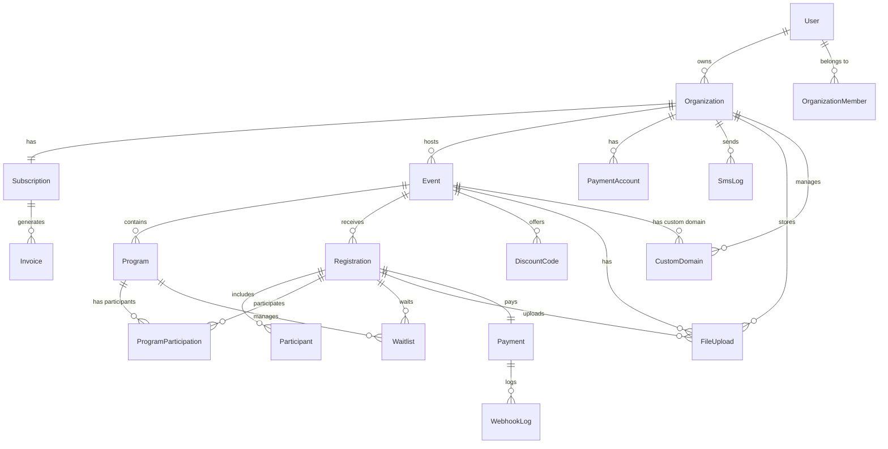

# 📊 Multi-Tenant Event Platform - Database Schema Design

## 🎯 Overview
Multi-tenant SaaS 이벤트 등록 플랫폼을 위한 완벽한 데이터베이스 스키마 설계입니다.
**최근 업데이트**: SMS 발송, 할인 코드, 대기자 관리, 파일 스토리지 기능 추가

## 📋 Table of Contents
1. [User & Authentication](#user--authentication)
2. [Organization & Subscription](#organization--subscription)
3. [Event Management](#event-management)
4. [Registration & Participants](#registration--participants)
5. [Payment System](#payment-system)
6. [Communication & Customization](#communication--customization)
7. [Storage Management](#storage-management)
8. [Analytics & Audit](#analytics--audit)

---

## User & Authentication

### 1. User Table
```prisma
enum UserRole {
  SUPER_ADMIN     // 플랫폼 운영자 (SaaS 판매자)
  ORG_OWNER       // 기관 소유자 (구매 결정권자)
  ORG_ADMIN       // 기관 관리자 (행사 생성/관리)
  ORG_STAFF       // 기관 스태프 (제한된 권한)
  PARTICIPANT     // 일반 참가자
}

model User {
  id                String    @id @default(uuid())
  email             String    @unique
  name              String
  password          String?   // OAuth 사용자는 null
  role              UserRole  @default(PARTICIPANT)
  emailVerified     DateTime?
  phone             String?
  profileImage      String?
  lastLoginAt       DateTime?
  isActive          Boolean   @default(true)
  metadata          Json      @default("{}")
  createdAt         DateTime  @default(now())
  updatedAt         DateTime  @updatedAt

  // Relations
  ownedOrganizations    Organization[]  @relation("OrgOwner")
  organizationMembers   OrganizationMember[]
  createdEvents         Event[]         @relation("EventCreator")
  registrations         Registration[]
  activityLogs          ActivityLog[]
  notifications         Notification[]
}
```

### 2. OrganizationMember Table
기관별 사용자 권한을 관리하는 다대다 관계 테이블입니다.

```prisma
model OrganizationMember {
  id            String      @id @default(uuid())
  userId        String
  orgId         String
  role          UserRole    // 기관 내 역할
  permissions   Json        // 세부 권한 설정
  invitedBy     String?
  invitedAt     DateTime?
  acceptedAt    DateTime?
  isActive      Boolean     @default(true)

  user          User        @relation(fields: [userId], references: [id])
  organization  Organization @relation(fields: [orgId], references: [id])

  @@unique([userId, orgId])
  @@index([orgId])
  @@index([userId])
}
```

#### Permission JSON Structure Example
```json
{
  "events": {
    "create": true,
    "edit": true,
    "delete": false,
    "publish": true
  },
  "registrations": {
    "view": true,
    "approve": true,
    "export": true,
    "refund": false
  },
  "payments": {
    "view": true,
    "process": false,
    "refund": false
  },
  "settings": {
    "branding": false,
    "payment": false,
    "team": true
  }
}
```

---

## Organization & Subscription

### 3. Organization Table
각 기관(고객)을 나타내는 핵심 테이블입니다.

```prisma
enum SubscriptionPlan {
  FREE        // 무료 (1개 행사, 50명)
  BASIC       // 기본 (3개 행사, 200명)
  PRO         // 프로 (10개 행사, 1000명)
  ENTERPRISE  // 기업 (무제한, 커스텀)
}

enum SubscriptionStatus {
  TRIAL
  ACTIVE
  PAST_DUE
  CANCELLED
  SUSPENDED
}

model Organization {
  id                String    @id @default(uuid())
  slug              String    @unique  // URL용 고유 식별자
  name              String
  nameEn            String?
  description       String?   @db.Text

  // 소유자 정보
  ownerId           String
  owner             User      @relation("OrgOwner", fields: [ownerId], references: [id])

  // 브랜딩 & 커스터마이징
  logo              String?
  favicon           String?
  primaryColor      String    @default("#000000")
  customDomain      String?   @unique
  domainVerified    Boolean   @default(false)

  // 연락처 정보
  email             String
  phone             String?
  address           Json?
  timezone          String    @default("Asia/Seoul")
  locale            String    @default("ko")

  // 설정
  settings          Json      @default("{}") // 기타 설정
  features          Json      @default("{}") // 활성화된 기능
  isActive          Boolean   @default(true)
  isVerified        Boolean   @default(false)
  
  // 스토리지 관리
  storageUsed       BigInt    @default(0) // bytes 단위

  createdAt         DateTime  @default(now())
  updatedAt         DateTime  @updatedAt

  // Relations
  subscription      Subscription?
  members           OrganizationMember[]
  events            Event[]
  paymentAccounts   PaymentAccount[]
  emailTemplates    EmailTemplate[]
  customForms       CustomForm[]
  activityLogs      ActivityLog[]
  smsLogs           SmsLog[]
  fileUploads       FileUpload[]
  customDomains     CustomDomain[]      // 커스텀 도메인 관리
}
```

### 4. Subscription Table
기관의 구독 정보를 관리합니다.

```prisma
model Subscription {
  id                String              @id @default(uuid())
  orgId             String              @unique
  plan              SubscriptionPlan    @default(FREE)
  status            SubscriptionStatus  @default(TRIAL)

  // 구독 기간
  trialEndsAt       DateTime?
  currentPeriodStart DateTime
  currentPeriodEnd  DateTime
  cancelledAt       DateTime?

  // 제한 사항
  maxEvents         Int                 // 플랜별 최대 행사 수
  maxParticipants   Int                 // 플랜별 최대 참가자 수
  maxAdmins         Int                 @default(5)
  storageLimit      BigInt              // bytes 단위

  // 결제 정보
  billingCycle      String              @default("monthly") // monthly, yearly
  price             Decimal             @db.Decimal(10, 2)
  currency          String              @default("KRW")

  // 기능 플래그
  features          Json                @default("{}")

  metadata          Json                @default("{}")
  createdAt         DateTime            @default(now())
  updatedAt         DateTime            @updatedAt

  organization      Organization        @relation(fields: [orgId], references: [id])
  invoices          Invoice[]
}
```

#### Features JSON Example
```json
{
  "customDomain": true,
  "emailAutomation": true,
  "advancedAnalytics": false,
  "apiAccess": true,
  "whiteLabel": false,
  "maxCustomForms": 5,
  "maxEmailTemplates": 10,
  "supportLevel": "premium"
}
```

---

## Event Management

### 5. Event Table
행사 정보를 저장하는 테이블입니다.

```prisma
model Event {
  id                String    @id @default(uuid())
  orgId             String
  slug              String

  // 기본 정보
  title             String
  titleEn           String?
  description       String?   @db.Text
  descriptionEn     String?   @db.Text

  // 일정
  startDate         DateTime
  endDate           DateTime
  registrationStart DateTime
  registrationEnd   DateTime
  earlyBirdEnd      DateTime?

  // 장소
  venue             String?
  venueAddress      Json?
  onlineUrl         String?   // 온라인 행사용

  // 제한 & 가격
  maxParticipants   Int?
  basePrice         Decimal   @db.Decimal(10, 2)
  earlyBirdPrice    Decimal?  @db.Decimal(10, 2)
  currency          String    @default("KRW")

  // 상태 & 설정
  status            String    @default("draft")
  // draft, published, ongoing, completed, cancelled
  visibility        String    @default("public")
  // public, private, unlisted
  requiresApproval  Boolean   @default(false)

  // 커스터마이징
  customFormId      String?
  emailTemplateIds  Json      @default("[]")
  tags              String[]

  // 도메인 & 브랜딩 (이벤트별)
  customDomain      String?   @unique   // 이벤트 전용 커스텀 도메인
  domainVerified    Boolean   @default(false)
  customBranding    Json?     // 이벤트별 브랜딩 설정

  // 통계
  totalRegistrations Int      @default(0)
  totalRevenue      Decimal   @default(0) @db.Decimal(10, 2)

  // 생성자 정보
  createdBy         String
  creator           User      @relation("EventCreator", fields: [createdBy], references: [id])

  metadata          Json      @default("{}")
  createdAt         DateTime  @default(now())
  updatedAt         DateTime  @updatedAt

  organization      Organization @relation(fields: [orgId], references: [id])
  programs          Program[]
  registrations     Registration[]
  customForm        CustomForm?  @relation(fields: [customFormId], references: [id])
  discountCodes     DiscountCode[]
  fileUploads       FileUpload[]
  customDomains     CustomDomain[]       // 이벤트별 커스텀 도메인

  @@unique([orgId, slug])
  @@index([orgId])
  @@index([status])
  @@index([startDate])
}
```

### 6. Program Table
행사 내 세부 프로그램/세션을 관리합니다.

```prisma
model Program {
  id                String    @id @default(uuid())
  eventId           String
  code              String

  title             String
  titleEn           String?
  description       String?   @db.Text

  // 일정 & 장소
  startTime         DateTime
  endTime           DateTime
  location          String?

  // 제한 & 가격
  maxCapacity       Int?
  currentCount      Int       @default(0)
  price             Decimal?  @db.Decimal(10, 2) // null이면 Event 가격 사용

  // 옵션
  isRequired        Boolean   @default(false)
  allowWaitlist     Boolean   @default(false)

  metadata          Json      @default("{}")
  createdAt         DateTime  @default(now())
  updatedAt         DateTime  @updatedAt

  event             Event     @relation(fields: [eventId], references: [id], onDelete: Cascade)
  participations    ProgramParticipation[]
  waitlists         Waitlist[]

  @@unique([eventId, code])
  @@index([eventId])
}
```

### 7. DiscountCode Table
할인 코드 및 프로모션을 관리합니다.

```prisma
model DiscountCode {
  id                String    @id @default(uuid())
  eventId           String
  code              String    @unique
  description       String?
  
  // 할인 정보
  discountType      String    // percentage, fixed
  discountValue     Decimal   @db.Decimal(10, 2)
  
  // 사용 제한
  maxUses           Int?
  currentUses       Int       @default(0)
  maxUsesPerUser    Int       @default(1)
  
  // 유효 기간
  validFrom         DateTime
  validUntil        DateTime
  
  // 적용 조건
  conditions        Json?     // 특정 조건 (회원사, 프로그램 등)
  minAmount         Decimal?  @db.Decimal(10, 2) // 최소 결제 금액
  
  // 상태
  isActive          Boolean   @default(true)
  
  metadata          Json      @default("{}")
  createdAt         DateTime  @default(now())
  updatedAt         DateTime  @updatedAt
  
  event             Event     @relation(fields: [eventId], references: [id], onDelete: Cascade)
  
  @@index([eventId])
  @@index([code])
  @@index([validFrom, validUntil])
}
```

### 8. CustomDomain Table
이벤트별 또는 기관별 커스텀 도메인을 체계적으로 관리합니다.

```prisma
enum DomainType {
  ORGANIZATION  // 기관 전체용: events.seoul-ubf.org
  EVENT         // 이벤트 전용: wmc2026.seoul-ubf.org, wmc2026.com
}

enum DomainStatus {
  PENDING       // DNS 설정 대기
  VERIFYING     // 검증 진행 중
  VERIFIED      // 검증 완료
  FAILED        // 검증 실패
  EXPIRED       // 만료됨
  SUSPENDED     // 일시 중단
}

model CustomDomain {
  id                String       @id @default(uuid())
  
  // 연결 정보
  orgId             String
  eventId           String?      // null이면 기관 전체용
  
  // 도메인 정보
  domain            String       @unique
  type              DomainType
  isPrimary         Boolean      @default(false)  // 기본 도메인 여부
  
  // 검증 상태
  status            DomainStatus @default(PENDING)
  verificationToken String?      // DNS TXT 레코드용 토큰
  verifiedAt        DateTime?
  
  // SSL 설정
  sslEnabled        Boolean      @default(false)
  sslStatus         String?      // pending, active, failed
  certificateId     String?      // SSL 인증서 ID
  sslIssuedAt       DateTime?
  sslExpiresAt      DateTime?
  
  // 리다이렉트 설정
  redirectTo        String?      // 리다이렉트 대상 도메인
  redirectType      Int         @default(301)  // 301, 302
  forceHttps        Boolean     @default(true)
  
  // DNS 설정 (자동 감지)
  dnsRecords        Json?       // A, CNAME 등 DNS 레코드 정보
  lastDnsCheck      DateTime?
  
  // 브랜딩 오버라이드 (이벤트용)
  customBranding    Json?       // 도메인별 특별한 브랜딩
  
  metadata          Json        @default("{}")
  createdAt         DateTime    @default(now())
  updatedAt         DateTime    @updatedAt
  
  organization      Organization @relation(fields: [orgId], references: [id])
  event             Event?       @relation(fields: [eventId], references: [id])
  
  @@index([orgId])
  @@index([eventId])
  @@index([domain])
  @@index([status])
}
```

#### Custom Branding JSON Example
```json
{
  "logo": "https://wmc2026.com/special-logo.png",
  "primaryColor": "#FF6B35",
  "secondaryColor": "#004225", 
  "favicon": "https://wmc2026.com/favicon.ico",
  "customCss": ".hero { background: linear-gradient(...) }",
  "socialMediaImage": "https://wmc2026.com/og-image.png",
  "analytics": {
    "googleAnalytics": "GA-XXXXX",
    "facebookPixel": "123456789"
  }
}
```

---

## Registration & Participants

### 9. Registration Table
등록 정보를 관리하는 핵심 테이블입니다.

```prisma
model Registration {
  id                String    @id @default(uuid())
  eventId           String
  userId            String?   // null이면 비회원 등록

  // 등록 정보
  registrationNumber String   @unique @default(cuid())
  type              String    @default("individual") // individual, group
  groupName         String?
  groupSize         Int       @default(1)

  // 참가자 정보 (비회원용)
  name              String
  email             String
  phone             String

  // 가격 정보
  baseAmount        Decimal   @db.Decimal(10, 2)
  discountAmount    Decimal   @default(0) @db.Decimal(10, 2)
  discountReason    String?
  taxAmount         Decimal   @default(0) @db.Decimal(10, 2)
  totalAmount       Decimal   @db.Decimal(10, 2)

  // 상태
  status            String    @default("pending")
  // pending, awaiting_payment, confirmed, attended, cancelled, refunded

  // 승인 처리
  requiresApproval  Boolean   @default(false)
  approvedAt        DateTime?
  approvedBy        String?

  // 추가 정보
  customFormData    Json?     // 커스텀 폼 응답
  notes             String?   @db.Text
  internalNotes     String?   @db.Text // 관리자 메모

  // QR/바코드
  qrCode            String?   @unique
  checkedInAt       DateTime?
  checkedInBy       String?

  metadata          Json      @default("{}")
  createdAt         DateTime  @default(now())
  updatedAt         DateTime  @updatedAt

  event             Event     @relation(fields: [eventId], references: [id])
  user              User?     @relation(fields: [userId], references: [id])
  payment           Payment?
  participants      Participant[]
  programParticipations ProgramParticipation[]
  waitlists         Waitlist[]
  fileUploads       FileUpload[]

  @@index([eventId])
  @@index([userId])
  @@index([email])
  @@index([status])
}
```

### 10. Participant Table
실제 참가자 정보를 저장합니다 (그룹 등록 시 여러 명).

```prisma
model Participant {
  id                String    @id @default(uuid())
  registrationId    String

  // 개인 정보
  firstName         String
  lastName          String
  firstNameEn       String?
  lastNameEn        String?
  email             String
  phone             String

  // 추가 정보
  birthDate         DateTime?
  gender            String?
  nationality       String?
  organization      String?
  position          String?

  // 여행 정보 (해외 참가자용)
  passportNumber    String?
  passportExpiry    DateTime?
  visaRequired      Boolean   @default(false)
  visaStatus        String?

  // 특별 요구사항
  dietaryRestrictions String?
  allergies         String?
  specialNeeds      String?
  emergencyContact  Json?

  // 체크인
  checkedIn         Boolean   @default(false)
  checkedInAt       DateTime?

  metadata          Json      @default("{}")
  createdAt         DateTime  @default(now())
  updatedAt         DateTime  @updatedAt

  registration      Registration @relation(fields: [registrationId], references: [id], onDelete: Cascade)

  @@index([registrationId])
  @@index([email])
}
```

### 9. ProgramParticipation Table
프로그램별 참가 기록을 관리합니다.

```prisma
model ProgramParticipation {
  id                String    @id @default(uuid())
  programId         String
  registrationId    String

  status            String    @default("registered")
  // registered, waitlist, attended, absent
  attendedAt        DateTime?

  program           Program   @relation(fields: [programId], references: [id])
  registration      Registration @relation(fields: [registrationId], references: [id])

  @@unique([programId, registrationId])
  @@index([programId])
  @@index([registrationId])
}
```

### 10. Waitlist Table
프로그램 대기자 명단을 관리합니다.

```prisma
model Waitlist {
  id                String    @id @default(uuid())
  programId         String
  registrationId    String
  
  // 대기 정보
  position          Int       // 대기 순번
  priority          Int       @default(0) // 우선순위 (높을수록 우선)
  
  // 알림 및 처리
  notifiedAt        DateTime? // 알림 발송 시점
  notificationCount Int       @default(0) // 알림 발송 횟수
  expiresAt         DateTime? // 대기 만료 시간
  
  // 상태 변경
  status            String    @default("waiting")
  // waiting, notified, confirmed, expired, cancelled
  confirmedAt       DateTime? // 확정 시점
  cancelledAt       DateTime? // 취소 시점
  cancelReason      String?
  
  metadata          Json      @default("{}")
  createdAt         DateTime  @default(now())
  updatedAt         DateTime  @updatedAt
  
  program           Program   @relation(fields: [programId], references: [id], onDelete: Cascade)
  registration      Registration @relation(fields: [registrationId], references: [id], onDelete: Cascade)
  
  @@unique([programId, registrationId])
  @@index([programId, status, position])
  @@index([registrationId])
}
```

---

## Payment System

### 11. Invoice Table (B2B)
플랫폼 구독료 청구서를 관리합니다.

```prisma
model Invoice {
  id                String    @id @default(uuid())
  subscriptionId    String
  invoiceNumber     String    @unique

  // 청구 정보
  amount            Decimal   @db.Decimal(10, 2)
  tax               Decimal   @db.Decimal(10, 2)
  totalAmount       Decimal   @db.Decimal(10, 2)
  currency          String    @default("KRW")

  // 상태
  status            String    @default("pending")
  // pending, paid, failed, refunded
  dueDate           DateTime
  paidAt            DateTime?

  // 세금계산서
  taxInvoiceNumber  String?
  taxInvoiceIssuedAt DateTime?

  // 결제 정보
  paymentMethod     String?
  paymentId         String?

  metadata          Json      @default("{}")
  createdAt         DateTime  @default(now())
  updatedAt         DateTime  @updatedAt

  subscription      Subscription @relation(fields: [subscriptionId], references: [id])
}
```

### 12. PaymentAccount Table
기관별 결제 게이트웨이 설정을 저장합니다.

```prisma
model PaymentAccount {
  id                String    @id @default(uuid())
  orgId             String
  provider          String    // toss, portone, stripe
  isActive          Boolean   @default(true)
  isDefault         Boolean   @default(false)

  // Provider 별 설정
  merchantId        String?
  apiKey            String?   @db.Text // 암호화 저장
  secretKey         String?   @db.Text // 암호화 저장
  webhookSecret     String?   @db.Text

  // 정산 정보
  bankName          String?
  bankAccount       String?
  accountHolder     String?

  settings          Json      @default("{}")
  createdAt         DateTime  @default(now())
  updatedAt         DateTime  @updatedAt

  organization      Organization @relation(fields: [orgId], references: [id])

  @@unique([orgId, provider])
  @@index([orgId])
}
```

### 13. Payment Table (B2C)
참가비 결제 정보를 관리합니다.

```prisma
model Payment {
  id                String    @id @default(uuid())
  registrationId    String    @unique

  // 결제 정보
  amount            Decimal   @db.Decimal(10, 2)
  currency          String    @default("KRW")
  method            String    // card, bank_transfer, virtual_account

  // 제공자 정보
  provider          String    // toss, portone
  providerId        String?   // 외부 결제 ID
  providerResponse  Json?     // 전체 응답 저장

  // 상태
  status            String    @default("pending")
  // pending, processing, completed, failed, cancelled, refunded, partial_refunded

  // 환불 정보
  refundAmount      Decimal?  @db.Decimal(10, 2)
  refundReason      String?
  refundedAt        DateTime?
  refundId          String?

  // 영수증/증빙
  receiptUrl        String?
  invoiceNumber     String?

  metadata          Json      @default("{}")
  createdAt         DateTime  @default(now())
  updatedAt         DateTime  @updatedAt

  registration      Registration @relation(fields: [registrationId], references: [id])
  webhookLogs       WebhookLog[]

  @@index([status])
  @@index([providerId])
}
```

### 14. WebhookLog Table
결제 웹훅 로그를 저장합니다.

```prisma
model WebhookLog {
  id                String    @id @default(uuid())
  paymentId         String?

  provider          String
  eventType         String
  payload           Json
  processed         Boolean   @default(false)
  processedAt       DateTime?
  error             String?   @db.Text

  createdAt         DateTime  @default(now())

  payment           Payment?  @relation(fields: [paymentId], references: [id])

  @@index([paymentId])
  @@index([provider, eventType])
}
```

---

## Communication & Customization

### 15. EmailTemplate Table
이메일 템플릿을 관리합니다.

```prisma
model EmailTemplate {
  id                String    @id @default(uuid())
  orgId             String

  name              String
  subject           String
  bodyHtml          String    @db.Text
  bodyText          String?   @db.Text

  // 템플릿 유형
  type              String
  // registration_confirmation, payment_success, reminder, custom

  // 변수 정의
  variables         Json      @default("[]")

  isActive          Boolean   @default(true)
  createdAt         DateTime  @default(now())
  updatedAt         DateTime  @updatedAt

  organization      Organization @relation(fields: [orgId], references: [id])

  @@unique([orgId, type])
  @@index([orgId])
}
```

#### Email Template Variables Example
```json
[
  "{{name}}",
  "{{event_title}}",
  "{{registration_number}}",
  "{{event_date}}",
  "{{venue}}",
  "{{amount}}",
  "{{payment_method}}"
]
```

### 16. CustomForm Table
커스텀 등록 폼을 정의합니다.

```prisma
model CustomForm {
  id                String    @id @default(uuid())
  orgId             String

  name              String
  description       String?

  // 폼 필드 정의
  fields            Json

  isActive          Boolean   @default(true)
  createdAt         DateTime  @default(now())
  updatedAt         DateTime  @updatedAt

  organization      Organization @relation(fields: [orgId], references: [id])
  events            Event[]

  @@index([orgId])
}
```

#### Custom Form Fields Example
```json
[
  {
    "id": "field_1",
    "type": "text",
    "label": "소속 교회",
    "labelEn": "Church Name",
    "required": true,
    "validation": {
      "minLength": 2,
      "maxLength": 100
    }
  },
  {
    "id": "field_2",
    "type": "select",
    "label": "식사 옵션",
    "labelEn": "Meal Option",
    "options": [
      {"value": "regular", "label": "일반"},
      {"value": "vegetarian", "label": "채식"},
      {"value": "halal", "label": "할랄"}
    ],
    "required": false
  },
  {
    "id": "field_3",
    "type": "checkbox",
    "label": "숙박 필요",
    "labelEn": "Need Accommodation",
    "required": false
  },
  {
    "id": "field_4",
    "type": "file",
    "label": "신분증 사본",
    "labelEn": "ID Copy",
    "accept": ".pdf,.jpg,.png",
    "maxSize": 5242880,
    "required": false
  }
]
```

### 17. Notification Table
사용자 알림을 관리합니다.

```prisma
model Notification {
  id                String    @id @default(uuid())
  userId            String

  type              String    // email, sms, push, in_app
  title             String
  content           String    @db.Text

  isRead            Boolean   @default(false)
  readAt            DateTime?

  // 연관 정보
  relatedType       String?   // event, registration, payment
  relatedId         String?

  metadata          Json      @default("{}")
  createdAt         DateTime  @default(now())

  user              User      @relation(fields: [userId], references: [id])

  @@index([userId, isRead])
  @@index([relatedType, relatedId])
}
```

### 18. SmsLog Table
SMS 발송 기록을 관리합니다.

```prisma
model SmsLog {
  id                String    @id @default(uuid())
  orgId             String
  
  // 수신자 정보
  recipient         String    // 수신자 전화번호
  recipientName     String?
  registrationId    String?   // 관련 등록 ID
  eventId           String?   // 관련 행사 ID
  
  // 메시지 내용
  message           String    @db.Text
  messageType       String    // registration, reminder, notification, marketing
  templateId        String?   // SMS 템플릿 ID
  
  // 발송 정보
  provider          String    // aligo, twilio, aws_sns 등
  providerId        String?   // 외부 제공자 메시지 ID
  
  // 상태
  status            String    @default("pending")
  // pending, sent, delivered, failed
  sentAt            DateTime?
  deliveredAt       DateTime?
  failedAt          DateTime?
  failureReason     String?
  
  // 비용
  cost              Decimal?  @db.Decimal(10, 2)
  
  metadata          Json      @default("{}")
  createdAt         DateTime  @default(now())
  
  organization      Organization @relation(fields: [orgId], references: [id])
  
  @@index([orgId])
  @@index([registrationId])
  @@index([status])
  @@index([createdAt])
}
```

---

## Storage Management

### 19. FileUpload Table
파일 업로드 및 스토리지 사용량을 관리합니다.

```prisma
model FileUpload {
  id                String    @id @default(uuid())
  orgId             String
  
  // 파일 정보
  fileName          String
  originalName      String
  fileType          String    // image, document, video, other
  mimeType          String
  fileSize          BigInt    // bytes
  
  // 저장 위치
  storageProvider   String    @default("local") // local, s3, cloudinary
  filePath          String    // 실제 저장 경로
  fileUrl           String    // 접근 가능한 URL
  thumbnailUrl      String?   // 썸네일 URL (이미지/비디오)
  
  // 연관 정보
  entityType        String?   // event, registration, participant, organization
  entityId          String?
  eventId           String?
  registrationId    String?
  
  // 업로드 정보
  uploadedBy        String
  uploadedAt        DateTime  @default(now())
  
  // 상태
  isPublic          Boolean   @default(false)
  isDeleted         Boolean   @default(false)
  deletedAt         DateTime?
  
  // 보안
  virusScanStatus   String?   // pending, clean, infected, error
  virusScanAt       DateTime?
  
  metadata          Json      @default("{}")
  createdAt         DateTime  @default(now())
  updatedAt         DateTime  @updatedAt
  
  organization      Organization @relation(fields: [orgId], references: [id])
  event             Event?       @relation(fields: [eventId], references: [id])
  registration      Registration? @relation(fields: [registrationId], references: [id])
  
  @@index([orgId])
  @@index([entityType, entityId])
  @@index([uploadedBy])
  @@index([isDeleted])
}
```

---

## Analytics & Audit

### 20. ActivityLog Table
모든 중요 활동을 기록하는 감사 로그입니다.

```prisma
model ActivityLog {
  id                String    @id @default(uuid())
  userId            String
  orgId             String?

  action            String    // create, update, delete, login, export
  entityType        String    // event, registration, payment, user
  entityId          String?

  // 변경 사항
  oldValues         Json?
  newValues         Json?

  // 요청 정보
  ipAddress         String?
  userAgent         String?

  createdAt         DateTime  @default(now())

  user              User      @relation(fields: [userId], references: [id])
  organization      Organization? @relation(fields: [orgId], references: [id])

  @@index([userId])
  @@index([orgId])
  @@index([entityType, entityId])
  @@index([createdAt])
}
```

### 21. Analytics Table
분석 데이터를 저장합니다.

```prisma
model Analytics {
  id                String    @id @default(uuid())
  orgId             String
  eventId           String?

  date              DateTime  @db.Date

  // 방문자 통계
  pageViews         Int       @default(0)
  uniqueVisitors    Int       @default(0)

  // 등록 퍼널
  registrationStarts Int      @default(0)
  registrationCompletes Int   @default(0)

  // 수익
  revenue           Decimal   @default(0) @db.Decimal(10, 2)

  // 상세 데이터
  hourlyData        Json?
  sourceData        Json?     // 유입 경로
  deviceData        Json?     // 디바이스 정보

  createdAt         DateTime  @default(now())

  @@unique([orgId, eventId, date])
  @@index([orgId])
  @@index([eventId])
  @@index([date])
}
```

---

## 🔗 Relationships Diagram



---

## 🎯 Key Design Decisions

### 1. Multi-Tenancy Strategy
- **Organization-based isolation**: 모든 데이터는 Organization ID로 격리
- **Flexible user roles**: 한 사용자가 여러 기관에 다른 역할로 소속 가능
- **Multi-level custom domains**: 기관별 + 이벤트별 커스텀 도메인 지원

### 2. Payment Dual System
- **B2B (Invoice)**: 플랫폼 구독료 관리
- **B2C (Payment)**: 행사 참가비 관리
- **Multiple providers**: TossPayments, PortOne 등 다중 PG 지원

### 3. Extensibility
- **JSON fields**: settings, metadata로 유연한 확장
- **Custom forms**: 기관별 커스텀 등록 폼
- **Email templates**: 다양한 이메일 템플릿 지원
- **Discount codes**: 프로모션 코드 시스템
- **SMS integration**: SMS 발송 기록 및 관리

### 4. Performance Optimization
- **Indexes**: 주요 쿼리 패턴에 맞는 인덱스 설계
- **Soft deletes**: isActive 플래그로 소프트 삭제
- **Counter cache**: totalRegistrations, currentCount 등 카운터 캐시
- **Storage management**: 파일 업로드 및 용량 관리

### 5. Queue Management
- **Waitlist system**: 프로그램별 대기자 관리
- **Priority handling**: 우선순위 기반 대기 처리
- **Auto-notification**: 자동 알림 시스템

### 6. Advanced Domain Management
- **Multi-level domains**: 기관별/이벤트별 커스텀 도메인 지원
- **Automatic verification**: DNS TXT 레코드를 통한 자동 도메인 검증
- **SSL management**: 자동 SSL 인증서 발급 및 갱신
- **Domain-specific branding**: 도메인별 독립적인 브랜딩 설정
- **Redirect handling**: 유연한 리다이렉트 및 HTTPS 강제 설정

### 7. Audit & Compliance
- **Activity logs**: 모든 중요 활동 기록
- **Webhook logs**: 결제 이벤트 추적
- **SMS logs**: 메시지 발송 내역 추적
- **File upload tracking**: 파일 업로드 이력 관리
- **Domain verification logs**: 도메인 검증 및 SSL 이력 관리
- **Data retention**: 법적 요구사항 준수