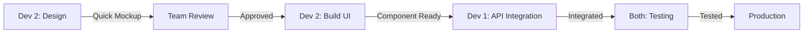

# 🚀 UBF Event Platform - Development Workflow
**Timeline**: September 18 - October 31, 2024 (6 weeks)
**Team**: 2 Developers
**Methodology**: Agile with 2-week sprints
**Focus**: Rapid MVP development with component-driven approach

## 👥 Team Structure & Responsibilities

### **Developer 1 - Backend/Fullstack Lead**
```yaml
Primary Focus:
  - Backend architecture & API development
  - Database design & optimization
  - Payment integration (TossPayments)
  - Authentication & authorization
  - Admin panel backend
  - Integration testing & deployment

Skills Required:
  - Next.js API Routes, tRPC
  - Prisma ORM, PostgreSQL
  - Payment gateway integration
  - Security implementation
  - Azure deployment
```

### **Developer 2 - Frontend/Design Developer**
```yaml
Primary Focus:
  - UI/UX design & implementation
  - Component library development
  - Registration flow UI
  - Multi-language support
  - Responsive design
  - Design system creation
  - User experience optimization

Skills Required:
  - React, Next.js
  - Tailwind CSS, Shadcn/ui
  - UI/UX design principles
  - Figma (basic)
  - i18n implementation
  - Form handling
  - Component architecture
```

## 📅 Sprint Planning

### **Sprint 0: Setup & Planning** (Sep 18-20, 3 days)
**Goal**: Project initialization and team alignment

#### Both Developers
- [ ] Project kickoff meeting
- [ ] Review requirements and architecture
- [ ] Setup development environment
- [ ] Create Git repository and branching strategy
- [ ] Divide initial responsibilities

#### Developer 1 (Backend Lead)
- [ ] Setup Next.js project structure
- [ ] Configure Azure PostgreSQL connection
- [ ] Initialize Prisma schema
- [ ] Setup authentication boilerplate
- [ ] Create API structure

#### Developer 2 (Frontend/Design)
- [ ] Setup Tailwind CSS
- [ ] Install and configure Shadcn/ui
- [ ] Setup i18n structure (ko/en/es)
- [ ] Create base layout components
- [ ] Define design tokens (colors, typography)
- [ ] Create initial UI mockups

---

### **Sprint 1: Foundation** (Sep 21 - Oct 4, 2 weeks)
**Goal**: Core infrastructure and base components

#### Week 1 Tasks

##### Developer 1 (Backend Lead)
```markdown
Monday-Tuesday:
- [ ] Complete database schema design
- [ ] Implement organization/tenant model
- [ ] Create event and program models

Wednesday-Thursday:
- [ ] Build authentication system (NextAuth)
- [ ] Implement user roles and permissions
- [ ] Create auth API endpoints

Friday:
- [ ] Setup tRPC router structure
- [ ] Create base API error handling
- [ ] Write auth integration tests
```

##### Developer 2 (Frontend/Design)
```markdown
Monday-Tuesday:
- [ ] Design and build layout components (Header, Footer, Navigation)
- [ ] Create responsive grid system
- [ ] Define color palette and typography
- [ ] Design authentication screens

Wednesday-Thursday:
- [ ] Build form components (Input, Select, Checkbox)
- [ ] Create button variants with all states
- [ ] Design registration flow UI (3-4 steps)
- [ ] Implement loading and error states

Friday:
- [ ] Build card components
- [ ] Create modal/dialog components
- [ ] Design mobile responsive versions
- [ ] Setup Storybook for component documentation
```

#### Week 2 Tasks

##### Developer 1 (Backend Lead)
```markdown
Monday-Tuesday:
- [ ] Implement registration model
- [ ] Create participant management
- [ ] Build pricing calculation logic

Wednesday-Thursday:
- [ ] Setup TossPayments integration
- [ ] Create payment models
- [ ] Implement webhook handlers

Friday:
- [ ] Build email service integration
- [ ] Create notification templates
- [ ] Setup job queue for async tasks
```

##### Developer 2 (Frontend/Design)
```markdown
Monday-Tuesday:
- [ ] Design event listing page layout
- [ ] Build event listing page
- [ ] Create event card component with hover states
- [ ] Implement filtering and search UI

Wednesday-Thursday:
- [ ] Design event detail page
- [ ] Build event detail page
- [ ] Create program selection component
- [ ] Design and implement pricing display

Friday:
- [ ] Design registration form UI
- [ ] Start registration form implementation (step 1)
- [ ] Build participant info forms
- [ ] Create form validation with error messages
```

---

### **Sprint 2: Registration & Payment** (Oct 5-18, 2 weeks)
**Goal**: Complete registration flow and payment integration

#### Week 3 Tasks

##### Developer 1 (Backend Lead)
```markdown
Monday-Tuesday:
- [ ] Complete payment flow implementation
- [ ] Build refund handling
- [ ] Create payment status tracking

Wednesday-Thursday:
- [ ] Implement group registration logic
- [ ] Build discount system
- [ ] Create early bird pricing

Friday:
- [ ] Build registration confirmation flow
- [ ] Implement email notifications
- [ ] Create PDF receipt generation
```

##### Developer 2 (Frontend/Design)
```markdown
Monday-Tuesday:
- [ ] Design multi-step registration flow
- [ ] Complete registration form (all steps)
- [ ] Build progress indicator with animations
- [ ] Implement form persistence

Wednesday-Thursday:
- [ ] Design payment UI screens
- [ ] Build payment selection UI
- [ ] Create payment method components
- [ ] Implement price summary with calculations

Friday:
- [ ] Design success/confirmation screens
- [ ] Build confirmation page
- [ ] Create success animations and feedback
- [ ] Implement error recovery flows
```

#### Week 4 Tasks

##### Developer 1 (Backend Lead)
```markdown
Monday-Tuesday:
- [ ] Build admin API endpoints
- [ ] Implement event management
- [ ] Create participant export

Wednesday-Thursday:
- [ ] Build reporting system
- [ ] Create analytics aggregation
- [ ] Implement caching layer

Friday:
- [ ] Performance optimization
- [ ] Security audit
- [ ] API documentation
```

##### Developer 2 (Frontend/Design)
```markdown
Monday-Tuesday:
- [ ] Design admin dashboard layout
- [ ] Build admin dashboard with widgets
- [ ] Create event management UI
- [ ] Implement participant list with filters

Wednesday-Thursday:
- [ ] Design data tables and bulk actions
- [ ] Build registration management interface
- [ ] Create bulk action components
- [ ] Implement export features with formats

Friday:
- [ ] Complete multi-language testing
- [ ] Fix responsive design issues
- [ ] Cross-browser testing and fixes
- [ ] Polish UI animations and transitions
```

---

### **Sprint 3: Polish & Launch** (Oct 19-31, ~2 weeks)
**Goal**: Testing, optimization, and production deployment

#### Week 5 Tasks

##### Developer 1 (Backend Lead)
```markdown
Monday-Tuesday:
- [ ] Integration testing
- [ ] Load testing
- [ ] Security testing

Wednesday-Thursday:
- [ ] Production environment setup
- [ ] Database optimization
- [ ] API rate limiting

Friday:
- [ ] Monitoring setup
- [ ] Error tracking (Sentry)
- [ ] Backup procedures
```

##### Developer 2 (Frontend/Design)
```markdown
Monday-Tuesday:
- [ ] Final UI polish and refinements
- [ ] E2E testing implementation
- [ ] Accessibility audit and fixes
- [ ] Performance optimization

Wednesday-Thursday:
- [ ] SEO optimization
- [ ] Meta tags and Open Graph implementation
- [ ] Sitemap generation
- [ ] Create user guide screenshots

Friday:
- [ ] PWA configuration
- [ ] Offline support implementation
- [ ] Final design system documentation
- [ ] Asset optimization (images, fonts)
```

#### Week 6 Tasks (Oct 28-31)

##### All Team
```markdown
Monday:
- [ ] Production deployment
- [ ] DNS configuration
- [ ] SSL setup

Tuesday:
- [ ] User acceptance testing
- [ ] Bug fixes
- [ ] Performance monitoring

Wednesday:
- [ ] Final testing
- [ ] Documentation review
- [ ] Training materials

Thursday (Oct 31):
- [ ] Go-live! 🚀
- [ ] Monitor system
- [ ] Quick fixes if needed
```

## 🔄 Daily Workflow

### **Daily Standup** (9:00 AM KST)
```yaml
Format: 15 minutes via Slack/Discord
Topics:
  - Yesterday's progress
  - Today's plan
  - Blockers
  - API/UI coordination needs
  - Design decisions
```

### **Development Process**


### **Git Workflow**
```bash
main
  └── develop
       ├── feature/auth-system (Dev 1)
       ├── feature/registration-ui (Dev 2)
       └── feature/payment-integration (Dev 1)
```

## 📊 Sprint Velocity Tracking

### **Story Points Allocation**
```yaml
Sprint 1: 40 points
  - Backend (Dev 1): 20 points
  - Frontend/Design (Dev 2): 20 points

Sprint 2: 50 points
  - Backend (Dev 1): 25 points
  - Frontend/Design (Dev 2): 25 points

Sprint 3: 30 points
  - Backend (Dev 1): 15 points
  - Frontend/Design (Dev 2): 15 points
```

## 🎯 Key Milestones

| Date | Milestone | Deliverable |
|------|-----------|-------------|
| Sep 20 | Project Kickoff | Development environment ready |
| Oct 4 | Sprint 1 Complete | Base components & auth system |
| Oct 18 | Sprint 2 Complete | Registration & payment flow |
| Oct 25 | Beta Testing | Full system testing |
| Oct 31 | **Launch** 🚀 | Production deployment |

## 🔧 Development Tools & Setup

### **Required Tools**
```yaml
Both Developers:
  - Node.js 20 LTS
  - VS Code with extensions
  - Git & GitHub account
  - Docker Desktop
  - PostgreSQL client

Developer 2 (Frontend/Design):
  - Figma (for quick mockups)
  - Browser DevTools
  - Responsively App (for responsive testing)
  - ColorZilla or similar color picker
```

### **VS Code Extensions**
```json
{
  "recommendations": [
    "dbaeumer.vscode-eslint",
    "esbenp.prettier-vscode",
    "bradlc.vscode-tailwindcss",
    "prisma.prisma",
    "formulahendry.auto-rename-tag",
    "christian-kohler.path-intellisense"
  ]
}
```

## 📈 Success Metrics

### **Sprint Success Criteria**
- ✅ 90% of planned story points completed
- ✅ Zero critical bugs in production
- ✅ All core features functional
- ✅ Payment processing working
- ✅ Multi-language support active
- ✅ Mobile responsive design
- ✅ Page load time < 3 seconds
- ✅ 95% uptime after launch

## 🚨 Risk Management

### **Identified Risks & Mitigations**
```yaml
Risk: Payment integration delays
Mitigation: Start integration in Sprint 1, have backup payment provider

Risk: Design and development by same person may slow progress
Mitigation: Quick mockups first, iterate on implementation, use existing UI libraries

Risk: Azure setup complexity
Mitigation: Use managed services, start with basic tier

Risk: Multi-language complexity
Mitigation: Start with Korean only for MVP, add others progressively

Risk: Team member absence
Mitigation: Knowledge sharing, documentation, pair programming
```

## 📝 Communication Channels

```yaml
Daily Standup: Slack #standup channel
Code Review: GitHub Pull Requests
Design Review: Figma comments
Urgent Issues: Discord voice channel
Documentation: Notion/Confluence
Task Tracking: Jira/GitHub Projects
```

## 🎉 Post-Launch Plan (November)

1. **Week 1**: Monitor and stabilize
2. **Week 2**: Gather user feedback
3. **Week 3**: Plan Phase 2 features
4. **Week 4**: Begin multi-tenant implementation

---

**Remember**: This is a living document. Adjust timelines and priorities based on actual progress and changing requirements. Daily communication is key to success! 🚀